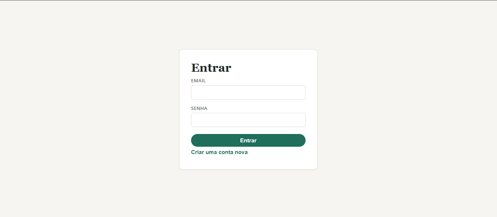
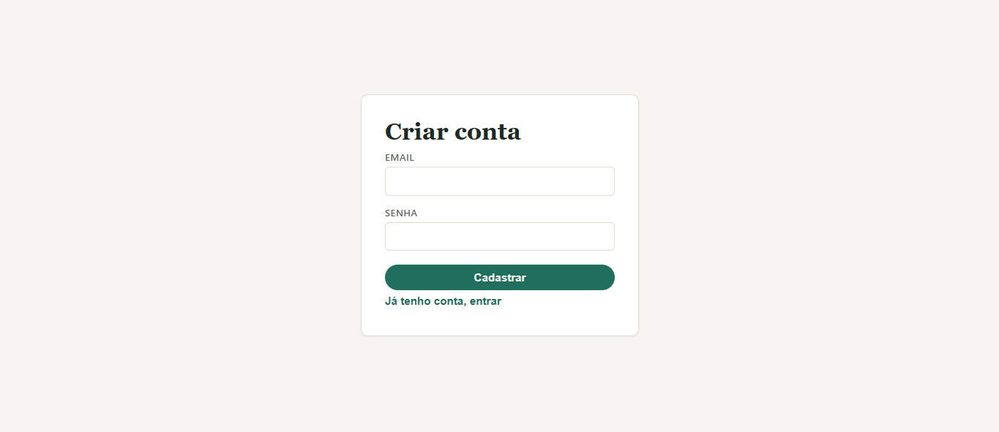
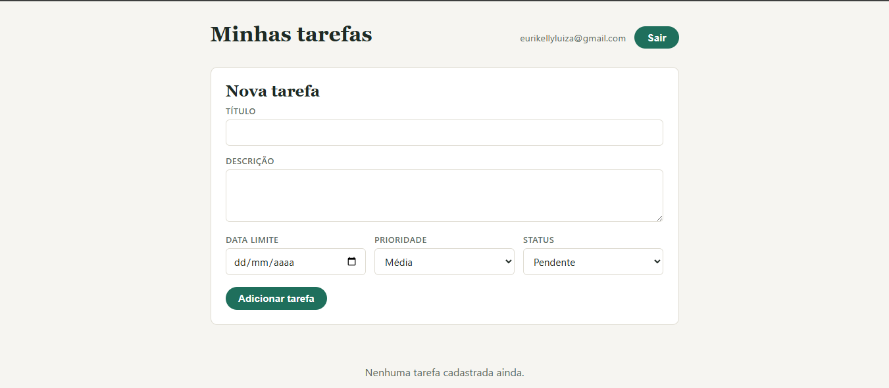
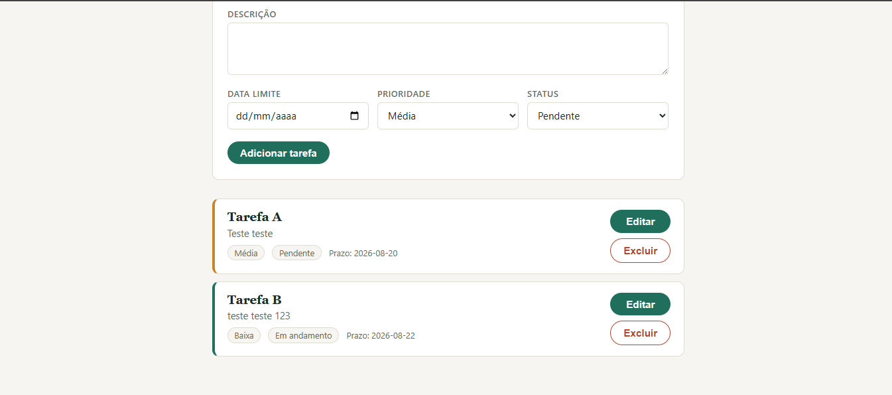
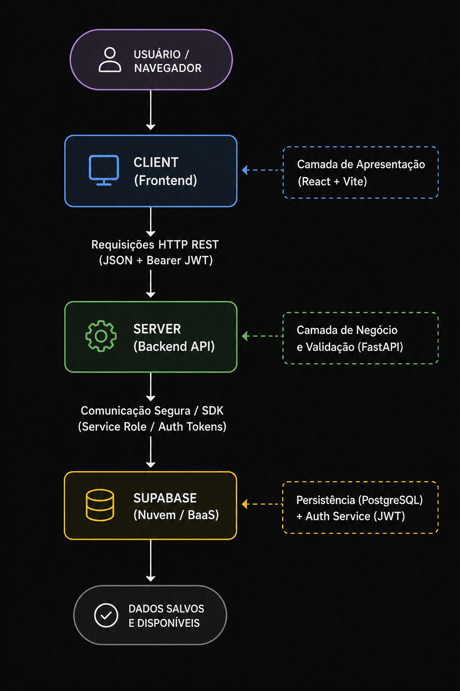

# Trabalho 01 - Sistema Distribuido
### CONCEITO DE SD COM SUPABASE
## Objetivo
Implementar um sistema distribuído de gerenciamento de tarefas, com cliente e
servidor separados, utilizando uma aplicação web simples.
O sistema permitirá que usuários autenticados criem e gerenciem suas próprias tarefas,
enquanto o frontend se comunica com uma API REST desenvolvida separadamente no
backend.

## Tecnologias Utilizadas

- #### Front-end - React 
- #### Back-end - FastAPI

- #### Infraestrutura - Docker

## Como Executar
### Pré-requisitos

- Docker instalado na máquina

Para executar o projeto no Docker, acesse a pasta raiz do projeto e execute o comando abaixo:

```bash
docker compose up --build -d
```
- Acesse o front-end no navegador: http://localhost:80
- A API estará disponível em: http://localhost:5000

Para remover os containers em execução:

```bash
docker compose down
```


## Prints da Inteface

<details>
  <summary><b>Visualizar as telas da aplicação</b></summary>
  <br />
  <h4>1. Autenticação</h4>
  <p align="center">
    
    
  </p>

  <h4>2. Gerenciamento de Tarefas</h4>
  <p align="center">
    
    
  </p>
</details>

## Estrutura do código
```bash

trabalho_sd_01/
├── .github/
│   └── assets/
│       ├── criar-conta.png
│       ├── login.png
│       ├── tarefas-criadas.png
│       └── tela-principal.png
├── .gitignore
├── docker-compose.yml
├── README.md
│
├── client/
│   ├── .dockerignore
│   ├── .gitignore
│   ├── .oxlintrc.json
│   ├── Dockerfile
│   ├── index.html
│   ├── package-lock.json
│   ├── package.json
│   ├── README.md
│   ├── vite.config.js
│   ├── public/
│   │   ├── favicon.svg
│   │   └── icons.svg
│   └── src/
│       ├── api.js
│       ├── App.jsx
│       ├── index.css
│       ├── main.jsx
│       ├── supabaseClient.js
│       ├── components/
│       │   ├── Alert.jsx
│       │   ├── TaskForm.jsx
│       │   ├── TaskItem.jsx
│       │   └── TaskList.jsx
│       ├── context/
│       │   └── AuthContext.jsx
│       ├── lib/
│       │   ├── localAuth.js
│       │   └── localTasks.js
│       └── pages/
│           ├── Login.jsx
│           └── Tasks.jsx
│
└── server/
    ├── .dockerignore
    ├── Dockerfile
    ├── main.py
    ├── requirements.txt
    ├── core/
    │   └── supabase.py
    ├── routers/
    │   ├── auth.py
    │   ├── create.py
    │   ├── delete.py
    │   ├── read.py
    │   └── update.py
    ├── schemas/
    │   ├── auth.py
    │   ├── create.py
    │   ├── delete.py
    │   └── update.py
    └── tests/
        ├── conftest.py
        ├── test_auth.py
        └── test_tasks.py
```

<details>
  <summary><b>Visualizar Fluxograma da Arquitetura </b></summary>
  <br />
  <p align="center">
    
  </p>
</details>


<details>
  <summary><b>Análise do Sistema Distribuído</b></summary>
  <br />

  <h4>1. Componentes</h4>
  <p><i>Quais partes independentes existem?</i></p>

  O sistema é estruturado em três componentes desacoplados:
  - **Frontend (Cliente):** SPA desenvolvida em React + Vite.
  - **Backend (API REST):** Servidor construído em Python com FastAPI.
  - **BaaS (Banco e Autenticação):** Plataforma gerenciada em nuvem Supabase (Auth JWT + PostgreSQL).

  <hr />

  <h4>2. Compartilhamento</h4>
  <p><i>O que é compartilhado?</i></p>

  - **Dados persistidos:** Tarefas armazenadas centralizadamente no PostgreSQL com isolamento lógico por usuário.
  - **Sessões e Autenticação:** Tokens JWT compartilhados e validados entre cliente, API e Supabase.
  - **Recursos computacionais:** A API e o banco atendem a múltiplos clientes de forma simultânea.

  <hr />

  <h4>3. Tipo de Sistema Distribuído</h4>
  <p><i>Computação, informação, pervasivo ou combinação?</i></p>

  - **Sistema Distribuído de Informação (Transacional):** Focado no gerenciamento, persistência, consistência e recuperação de dados com controle transacional e isolamento seguro de dados por usuário.

  <hr />

  <h4>4. Transparência</h4>
  <p><i>O que o usuário não precisa perceber?</i></p>

  - **Transparência de Localização e Distribuição:** O usuário final desconhece a localização física/geográfica dos servidores da API e do banco de dados na nuvem.
  - **Transparência de Acesso e Persistência:** A aplicação oculta toda a complexidade de rede (requisições HTTP REST, serialização JSON e consultas SQL), apresentando uma interface unificada e reativa.

  <hr />

  <h4>5. Escalabilidade</h4>
  <p><i>Como cresceria?</i></p>

  O sistema foi projetado para crescer horizontalmente:
  - **Frontend:** Pode ser distribuído globalmente através de CDNs/Edge networks.
  - **Backend (FastAPI):** Aplicação *stateless*, permitindo a criação de múltiplas réplicas em containers Docker/Kubernetes gerenciados por um Load Balancer.
  - **Banco de Dados (Supabase):** Suporta escalonamento com réplicas de leitura (*read replicas*) e *connection pooling*.

  <hr />

  <h4>6. Tratamento de Falhas</h4>
  <p><i>O que acontece se um componente parar?</i></p>

  O sistema implementa falha parcial com degradação controlada:
  - **Queda do Backend:** O Frontend continua ativo, captura o erro de rede e exibe notificações amigáveis ao usuário (`Alert.jsx`).
  - **Queda do Supabase:** A API FastAPI intercepta a falha e retorna códigos de erro padronizados (HTTP 500/503), sem expor detalhes internos do sistema.
  - **Isolamento de Processos:** Uma pane em uma camada não corrompe o estado ou execução das outras.
</details>

## Suíte de Testes Automatizados (Pytest)
### Como Instalar as Dependências de Teste
- Acessar o diretório server/
```bash
cd server
```
- Ative o ambiente virtual 
- Instale as dependências
```bash
pip install -r requirements.txt
```
### Como Executar os Testes
- Execução Local (na pasta server ou raiz com venv ativa)
```bash
pytest -v
```
### Execução via Docker:
```bash
docker compose exec server pytest -v
```
### Quantidade de Testes Implementados
- Total: 12 testes automatizados
   - test_auth.py: 5 testes
   - test_tasks.py: 7 testes

### Descrição do que Cada Grupo de Testes Valida   

- #### Autenticação e Registo (server/tests/test_auth.py - 5 testes)
    - test_cadastrar_sucesso: Valida o registo de um novo utilizador com dados válidos (POST /cadastrar).

    - test_cadastrar_falha: Valida o tratamento de exceções e retorno HTTP 400 em caso de erro no registo (ex.: e-mail já registado).

    - test_login_sucesso: Valida o processo de login com credenciais válidas e o retorno do token de acesso JWT (POST /login).

    - test_login_credenciais_invalidas: Valida a recusa de acesso com credenciais incorretas (HTTP 401).

    - test_login_campos_faltando: Valida a validação automática do schema Pydantic quando faltam campos obrigatórios (HTTP 422).

- #### Autorização e Segurança (server/tests/test_tasks.py - 2 testes)
    - test_rota_protegida_sem_token: Valida o bloqueio com código HTTP 401 ao tentar aceder a rotas privadas sem o cabeçalho Authorization.

    - test_rota_protegida_token_invalido: Valida o bloqueio com código HTTP 401 quando o token fornecido é inválido ou expirou.

- #### Operações CRUD de Tarefas (server/tests/test_tasks.py - 5 testes)
    - test_listar_tarefas_sucesso: Valida a recuperação de tarefas pertencentes exclusivamente ao utilizador autenticado (GET /read).

    - test_criar_tarefa_sucesso: Valida a inserção correta de uma nova tarefa com título, descrição, data limite, prioridade e status (POST /create).

    - test_atualizar_tarefa_sucesso: Valida a modificação dos dados de uma tarefa existente (PUT /update).

    - test_atualizar_tarefa_nao_encontrada: Valida o retorno HTTP 404 ao tentar atualizar uma tarefa inexistente ou que pertence a outro utilizador.

    - test_deletar_tarefa_sucesso: Valida a remoção de uma tarefa vinculada ao utilizador autenticado (DELETE /delete).

### Resultado da Execução dos Testes
```bash
=========================================================== test session starts ===========================================================
platform linux -- Python 3.14.7, pytest-9.1.1, pluggy-1.6.0 -- /usr/local/bin/python3.14
cachedir: .pytest_cache
rootdir: /app
plugins: anyio-4.14.2
collected 12 items                                                                                                                        

tests/test_auth.py::test_cadastrar_sucesso PASSED                                                                                   [  8%]
tests/test_auth.py::test_cadastrar_falha PASSED                                                                                     [ 16%]
tests/test_auth.py::test_login_sucesso PASSED                                                                                       [ 25%]
tests/test_auth.py::test_login_credenciais_invalidas PASSED                                                                         [ 33%]
tests/test_auth.py::test_login_campos_faltando PASSED                                                                               [ 41%]
tests/test_tasks.py::test_rota_protegida_sem_token PASSED                                                                           [ 50%]
tests/test_tasks.py::test_rota_protegida_token_invalido PASSED                                                                      [ 58%]
tests/test_tasks.py::test_listar_tarefas_sucesso PASSED                                                                             [ 66%]
tests/test_tasks.py::test_criar_tarefa_sucesso PASSED                                                                               [ 75%]
tests/test_tasks.py::test_atualizar_tarefa_sucesso PASSED                                                                           [ 83%]
tests/test_tasks.py::test_atualizar_tarefa_nao_encontrada PASSED                                                                    [ 91%]
tests/test_tasks.py::test_deletar_tarefa_sucesso PASSED                                                                             [100%]

=========================================================== 12 passed in 0.46s ============================================================
```